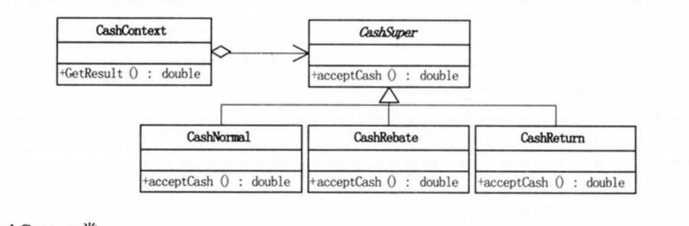

## 策略模式

    所谓的软件里面的设计模式，经常是由于里面有一些实际的问题而催生的。
    比如说一个安装量相当大的软件，比如说超市里面的收银软件。那些个产品打折，
    什么时间段打折你学要重启么？需要收银员或者最次也要是网关这样的人去收拾一下的。
    让所有的人升级软件本身是一件机器头痛的事情。
    
 侧率模式的定义：他定义了算法家族，分别封装起来，让他们之间可以相互替换，这个模式
 让算法上的变化不会影响使用算法的客户端。
 
 - 总结
 
 测试模式适用于一组算法完成相同的工作只不过是实现不同，所以有了策略模式
 他可以用相同的方式调取所有的算法，减少了各种算法之间的耦合。
 
还有他的层次为Contex类定义了一系列的可以重用的算法或者行为。继承有助于提取出这些算法当中公共的功能。

另外他还可以简化单元测试，因为每个算法都有自己的类，可以通过自己的接口单独测试。

- 策略模式封装了变化 消除了if else的重复定义书写。

- 任何需求的变更都是需要成本的。我们要做的事尽量的在需求变化的时候尽量的让成本变小。

