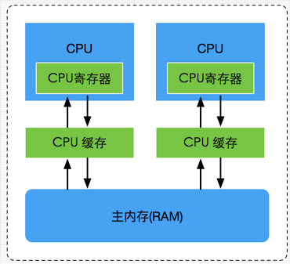

### java的内存模型

https://blog.csdn.net/javazejian/article/details/72772461#jmm%E5%AD%98%E5%9C%A8%E7%9A%84%E5%BF%85%E8%A6%81%E6%80%A7

线程通信是如何实现的？

答：共享变量和消息传递

----

### 内存模型

如图中所示，多线程当中线程私有的是不会问题的。

#### java 运行时对象在各个区域的分布（这里的区域指的是working memory 和 main memory）。

回答：弄清楚主内存和工作内存后，接了解一下主内存与工作内存的数据存储类型以及操作方式，根据虚拟机规范，对于一个实例对象中的成员方法而言，如果方法中包含本地变量是基本数据类型（boolean,byte,short,char,int,long,float,double），将直接存储在工作内存的**帧栈结构**中，但倘若本地变量是引用类型，那么该变量的引用会存储在功能内存的帧栈中，而对象实例将存储在主内存(共享数据区域，堆)中。

但对于实例对象的成员变量，不管它是基本数据类型或者包装类型(Integer、Double等)还是引用类型，都会被存储到堆区。

至于static变量以及类本身相关信息将会存储在主内存中。需要注意的是，在主内存中的实例对象可以被多线程共享，倘若两个线程同时调用了同一个对象的同一个方法，那么两条线程会将要操作的数据拷贝一份到自己的工作内存中，执行完成操作后才刷新到主内存

#### java内存模型和硬件内存架构

总而言之当一个CPU需要访问主存时，会先读取一部分主存数据到CPU缓存(当然如果CPU缓存中存在需要的数据就会直接从缓存获取)，进而在读取CPU缓存到寄存器，当CPU需要写数据到主存时，同样会先刷新寄存器中的数据到CPU缓存，然后再把数据刷新到主内存中

#### java的线程和硬件处理器

理解线程的实现原理，有助于我们了解Java内存模型与硬件内存架构的关系，在Window系统和Linux系统上，Java线程的实现是基于一对一的线程模型，**所谓的一对一模型，实际上就是通过语言级别层面程序去间接调用系统内核的线程模型**，即我们在使用Java线程时，Java虚拟机内部是转而调用当前操作系统的内核线程来完成当前任务。

这里需要了解一个术语，内核线程(Kernel-Level Thread，KLT)，它是由操作系统内核(Kernel)支持的线程，这种线程是由操作系统内核来完成线程切换，内核通过操作调度器进而对线程执行调度，并将线程的任务映射到各个处理器上。每个内核线程可以视为内核的一个分身,这也就是操作系统可以同时处理多任务的原因。由于我们编写的多线程程序属于语言层面的，程序一般不会直接去调用内核线程，取而代之的是一种轻量级的进程(Light Weight Process)，也是通常意义上的线程，由于每个轻量级进程都会映射到一个内核线程，因此我们可以通过轻量级进程调用内核线程，进而由操作系统内核将任务映射到各个处理器，这种轻量级进程与内核线程间1对1的关系就称为一对一的线程模型.

#### java的内存模型 和 硬件的内存模型之间的映射关系

---

#### java内存模型的承诺

* 原子性
* 理解指令 重排
  * 编译器

-----

#### 重排序

#### 顺序一致性

#### Happen-before

#### AS-IF-Serial

