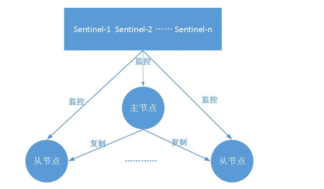

### 哨兵模式

原文来自于
https://www.cnblogs.com/kismetv/p/9609938.html

###主从复制有哪些问题，又有哪些解决方案？

Redis主从复制的作用有数据热备、负载均衡、故障恢复等；
但主从复制存在的一个问题是故障恢复**无法自动化**。
本文将要介绍的哨兵，它基于Redis主从复制，
主要作用便是解决主节点故障恢复的自动化问题，进一步提高系统的高可用性。

### redis为了高可用技术都哪些？分别解决了什么问题？有什么缺陷？如何改进？

首先从宏观角度回顾一下Redis实现高可用相关的技术。它们包括：持久化、复制、哨兵和集群

其主要作用和解决的问题是;

* 持久化：持久化是最简单的高可用方法(有时甚至不被归为高可用的手段)，主要作用是数据备份，即将数据存储在硬盘，保证数据不会因进程退出而丢失。
* 复制：复制是高可用Redis的基础，哨兵和集群都是在复制基础上实现高可用的。
  复制主要实现了数据的多机备份，以及对于读操作的负载均衡和简单的故障恢复。
  缺陷：故障恢复无法自动化；写操作无法负载均衡；存储能力受到单机的限制。
* 哨兵：在复制的基础上，哨兵实现了自动化的故障恢复。
  缺陷：写操作无法负载均衡；存储能力受到单机的限制。
* 集群：通过集群，Redis解决了写操作无法负载均衡，
  以及存储能力受到单机限制的问题，实现了较为完善的高可用方案。
  

### redis哨兵的功能描述

* 监控（Monitoring）：哨兵会不断地检查主节点和从节点是否运作正常。
* 自动故障转移（Automatic failover）：当主节点不能正常工作时，
哨兵会开始自动故障转移操作，它会将失效主节点的其中一个从节点升级为新的主节点，
并让其他从节点改为复制新的主节点。
* 配置提供者（Configuration provider）：客户端在初始化时，通过连接哨兵来获得当前Redis服务的主节点地址。

* 通知（Notification）：哨兵可以将故障转移的结果发送给客户端。

其中，监控和自动故障转移功能，使得哨兵可以及时发现主节点故障并完成转移；
而配置提供者和通知功能，则需要在与客户端的交互中才能体现。

_读完了上面的描述有没有发现和dubbo特别相似，用一个中间件作为服务的发现提供的组件
非常了不得 要查一下哨兵的实现原理_

### 作用和架构

哨兵模式的架构图如下所示：

它由两部分组成，哨兵节点和数据节点：

* 哨兵节点：哨兵系统由一个或多个哨兵节点组成，哨兵节点是特殊的redis节点，不存储数据。
* 数据节点：主节点和从节点都是数据节点。

### 哨兵的搭建过程作用详解？

哨兵系统的搭建过程，有几点需要注意：

* （1）哨兵系统中的主从节点，与普通的主从节点并没有什么区别，
       故障发现和转移是由哨兵来控制和完成的。

* （2）哨兵节点本质上是redis节点。

* （3）每个哨兵节点，只需要配置监控主节点，便可以自动发现其他的哨兵节点和从节点。

* （4）在哨兵节点启动和故障转移阶段，各个节点的配置文件会被重写(config rewrite)。

* （5）本章的例子中，一个哨兵只监控了一个主节点；
       实际上，一个哨兵可以监控多个主节点，通过配置多条sentinel monitor即可实现。

